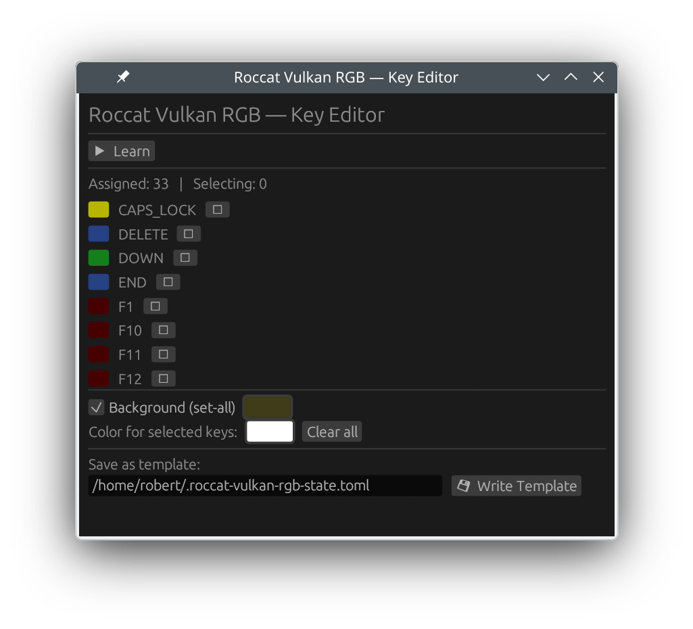

# roccat-vulkan-rgb

A small tool for writing RGB values to a ROCCAT Vulkan Pro TKL keyboard and reading back the values tracked by this tool. Works on openSUSE, I didn't try with any other keyboard models, see the udev rule.

## What "read" means here

The keyboard LED protocol used here is write-focused, I couldn't figure out how to read from the device. `get` reads the value from this tool's tracked state file (`.roccat-vulkan-rgb-state.toml`) in user's $HOME directory, if not specified otherwise.

That means:
- `set` updates the key(s) in the state file and writes a (full) frame to the device
- `get` returns the tracked value for the key(s) from the state file, not from the device

If another process or onboard effect changes lighting, `get` will not reflect those external changes.

The state file (`.roccat-vulkan-rgb-state.toml`) uses the same TOML template format as user-defined templates, so it can be re-pushed to the device at login or after a USB reconnect:

```bash
roccat-vulkan-rgb apply
```

## Setup (one-time, no root required after this)

Install the bundled udev rule so Linux grants the physically-logged-in user access to the keyboard's HID device nodes:

```bash
sudo cp 99-roccat-vulkan-pro-tkl.rules /etc/udev/rules.d/
sudo udevadm control --reload-rules
```

Then unplug and replug the keyboard. No `sudo` is needed from this point on, including after every subsequent replug. No group membership changes are needed.

The rule uses the systemd `uaccess` tag, which grants access only to the user at the local physical seat (seat0). Users connected via SSH or other non-seat sessions are not granted access. The ACL is removed automatically when the local user logs out. `RUN{builtin}+="uaccess"` ensures the ACL is applied immediately and synchronously on every plug event, preventing the race condition where permissions could be lost after a replug.

## Build

Quick run with
```bash
cargo run -- set-all --r 200 --g 255 --b 00
```
or build the binary with

```bash
cargo build --release
```
and copy the resulting target/release/roccat-vulkan-rgb to your ~/bin or whatever your preference is.

## Usage

Read key color from tracked state:

```bash
# by key name
roccat-vulkan-rgb get --key F5
# by raw LED matrix index
roccat-vulkan-rgb get --index 10
```

Set key color and write to keyboard:

```bash
# by key name
roccat-vulkan-rgb set --key CAPS_LOCK --r 0 --g 180 --b 255
# by raw LED matrix index
roccat-vulkan-rgb set --index 10 --r 255 --g 40 --b 0
```

Set all keys in one write (fast path):

```bash
roccat-vulkan-rgb set-all --r 255 --g 0 --b 0
```

Skip control init for repeated writes (faster, use only when keyboard is already in host mode):

```bash
roccat-vulkan-rgb set-all --r 0 --g 0 --b 255 --no-init
```

Dry run without writing to keyboard:

```bash
roccat-vulkan-rgb set --key ENTER --r 255 --g 40 --b 0 --dry-run
```

Reset all keys to black and write to keyboard:

```bash
roccat-vulkan-rgb reset
```

Reset state only without writing to keyboard:

```bash
roccat-vulkan-rgb reset --dry-run
```

Re-push the current state to the keyboard (e.g. at login or after USB reconnect):

```bash
roccat-vulkan-rgb apply
```

`apply` reads the state file and writes the full LED frame to the device without modifying the state. It is the recommended command to restore lighting in autostart scripts. `--dry-run` and `--no-init` are supported.

List available key names:

```bash
roccat-vulkan-rgb list-keys
```

## Templates

Templates are TOML files that describe a lighting state. They can be edited by hand and shared.
Colors are `[R, G, B]` arrays in range 0–255. The three sections are all optional, but at least one section with one entry is required. When loaded, sections are applied in order — `[set-all]` first as the base, then `[key]`, then `[index]` — so later sections can override earlier ones.

```toml
# Roccat Vulkan Pro TKL — RGB template
# Colors are [R, G, B] values in range 0–255.
# Sections are all optional; at least one section with one entry is required.
# Applied in order: [set-all] → [key] → [index]

[set-all]
ALL = [0, 0, 180]

[key]
ESC       = [255, 0,  0 ]
CAPS_LOCK = [255, 80, 0 ]
SPACE     = [0, 255, 80 ]

[index]
18 = [0, 0, 0]
```

Save the current state as a template:

```bash
roccat-vulkan-rgb save-template my-theme.toml
```

Load a template and apply it to the keyboard:

```bash
roccat-vulkan-rgb load-template my-theme.toml
# Preview without writing to device
roccat-vulkan-rgb load-template my-theme.toml --dry-run
# Skip init sequence (keyboard already in host mode)
roccat-vulkan-rgb load-template my-theme.toml --no-init
# Load at reduced brightness (template colours are saved unscaled)
roccat-vulkan-rgb load-template my-theme.toml --intensity 60
```

See `example-template.toml` in this repository for a ready-to-edit starting point.

## Effects

Effects read the current saved state, transform it in memory, and push the result to the keyboard. The state file is **not** modified, so the original colours are always preserved for the next `apply` or `effect` call.

### Intensity

Scale all LED brightness by a percentage. `0` turns everything off, `100` is unchanged, values above `100` amplify (clamped at 255):

```bash
# Half brightness
roccat-vulkan-rgb effect --intensity 50
# Full off
roccat-vulkan-rgb effect --intensity 0
# 150 % (boosted, clamped per channel)
roccat-vulkan-rgb effect --intensity 150
# Preview without writing to device
roccat-vulkan-rgb effect --intensity 75 --dry-run
```

## GUI Editor



The editor provides a graphical way to build and save templates without hand-editing TOML.

```bash
roccat-vulkan-rgb editor
```

### What it does

- **Learn mode** — press "▶ Learn", tap the keys you want to colour, the keyboard is unavailable during learning for text input. Press "⏹ Stop Learning" makes it become available again. The selected keys are listed in the panel. You need to authenticate as root for this.
- **Background colour** — tick "Background (set-all)" and pick a colour to set all LEDs to a base colour. The entire keyboard is flooded with that colour before per-key overrides are applied.
- **Per-key colour** — after stopping learn mode, use the colour picker to assign a colour to the keys you just selected. Start another learn session to pick a different group and colour. Each round accumulates into the same template; individual keys can be removed with the ✕ button.
- **Live preview** — colour changes are pushed to the keyboard immediately so you can see the result without saving.
- **Write Template** — saves all assignments to the file shown in the path field. Defaults to the standard state file (`~/.roccat-vulkan-rgb-state.toml`); change the path field to target a different file. The write is refused if the target file already exists but is not a recognised template, to avoid overwriting unrelated files.

The editor reads the state file on startup to pre-populate the background colour and any existing per-key assignments, so you always continue from the current state.

### Learn mode and permissions

Reading raw key events requires access to `/dev/input/event*`. If your user is not in the `input` group the editor automatically falls back to running a privileged helper via `pkexec` (the standard polkit privilege-escalation tool). A password prompt appears the first time.

To avoid repeated prompts, install the bundled polkit rule so the credential is cached for the session timeout (~5 minutes):

```bash
sudo cp 50-roccat-vulkan-rgb.rules /etc/polkit-1/rules.d/
```

No reload is needed — polkit watches the directory automatically. The rule matches only the `--evdev-helper` invocation of this binary and is restricted to the physically logged-in user.

Alternatively, adding your user to the `input` group (and logging out/in once) eliminates the prompt entirely:

```bash
sudo usermod -aG input $USER
```


A ready-made `.desktop` file (`roccat-vulkan-rgb.desktop`) is included. It calls `roccat-vulkan-rgb apply` automatically when your desktop session starts, so the keyboard lighting is restored after every login or USB reconnect.

Place it in your user autostart directory:

```bash
cp roccat-vulkan-rgb.desktop ~/.config/autostart/
```

`~/.config/autostart/` is the XDG standard location supported by GNOME, KDE Plasma, XFCE, and most other desktop environments. The binary must be on your `$PATH` (e.g. in `~/bin` or `/usr/local/bin`).

For non-desktop / TTY environments you can instead add the equivalent call to `~/.bash_profile` or `~/.profile`:

```bash
roccat-vulkan-rgb apply
```

## Notes

- Use `--key <name>` to address a key by name (e.g. `ESC`, `A`, `F5`, `CAPS_LOCK`, `1`, `2`, …) or `--index <n>` to address a key by its raw LED matrix index (0..126). The two options are mutually exclusive.
- Named keys are mapped to the Vulkan Pro TKL ISO matrix indices used by Eruption device tables; run `list-keys` to see all names and their indices.
- The tool communicates with the keyboard over two HID interfaces (USB `VID 1e7d` / `PID 311a`): the LED interface for color frames and the control interface for the host-mode init sequence.
- On `set`, `set-all`, and `reset`, the control-interface init sequence is sent first unless `--no-init` is given.
- `set-all` is much faster than calling `set` many times because it updates all keys with one frame write.
- For speed-sensitive loops, use the compiled binary directly instead of `cargo run`.
